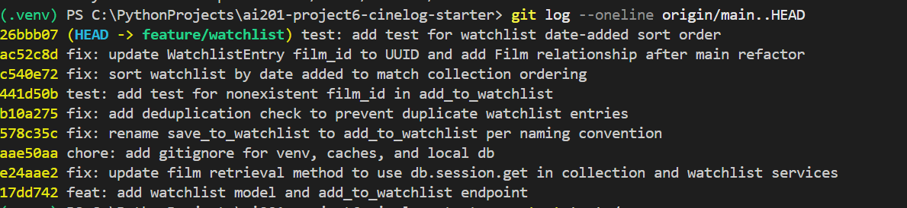

# PR Response Doc — CineLog Watchlist Feature

## AI Usage

I used Claude in three ways during this project.

**Orientation.** Before writing the deduplication logic for Comment 2, I asked it to walk
me through what `add_to_collection()` does step by step, specifically what happens when a
duplicate is detected and in what order the checks run. I then wrote my own version of the
check in `add_to_watchlist()` following that pattern rather than having it generate the
code.

**Stress-testing my design arguments.** For Comments 4 and 5 I wrote my positions first,
then asked what counterarguments a careful reviewer would raise. On Comment 4 it pointed
out that my original draft was generic, that "privacy by design" could be pasted into any
PR, and that I hadn't used the CineLog-specific fact that `CollectionEntry` has no
visibility field at all. It also caught that I was arguing for opt-in without noting that
`add_to_watchlist()` has no `public` parameter to opt in with. I added both points.

**Where I overrode it.** In my first Comment 5 draft I mentioned an `AttributeError` in
`models.py`. Claude told me that hadn't happened and to delete the claim. When I actually
made the sort-order change and dropped the `.join(Film)`, the code failed with exactly that
`AttributeError` — the join had been masking a missing `WatchlistEntry` relationship on the
`Film` model. The AI was confidently wrong; running the test settled it.

It also told me to strip a `rating` field out of my sort-order test when copying it from
`test_collection.py`. There was no `rating` field in that test. I checked the file rather
than following the instruction.

---

## Comment 1 — Rename

**What I did:**
Renamed `save_to_watchlist()` to `add_to_watchlist()` in `services/watchlist_service.py`
and updated both call sites in `routes/watchlist/watchlist.py`: the import on line 8 and
the invocation inside `add_film()` on line 32. I also updated the docstring summary from
"Save a film to a user's watchlist" to "Add a film to a user's watchlist" so the
documentation matches the new name.

The rename brings the watchlist service in line with the existing convention in
`services/collection_service.py`, which uses `add_to_collection()` / `remove_from_collection()`.
The module docstring in that file explicitly states that all functions follow the project's
verb_to_noun naming convention, so `save_to_` was the outlier.

**How I verified:**
Before making any edits I ran a project-wide search to find every reference:

    grep -rn "save_to_watchlist" services/ routes/

This returned three source hits: the definition at `services/watchlist_service.py:12`,
the import at `routes/watchlist/watchlist.py:8`, and the call at `routes/watchlist/watchlist.py:32`.

After the rename I re-ran the same search and got zero source hits (only stale `.pyc`
bytecode matched, which is untracked and regenerates). I then confirmed the new name
resolved everywhere with `grep -rn "add_to_watchlist" services/ routes/`, which returned
the same three locations.

Full suite passed: `pytest tests/ -v` → 4 passed.

---

## Comment 2 — Deduplication

**What I did:**
I opened `services/collection_service.py` and read add_to_collection() to see how CineLog already handles duplicates. That function runs a query on CollectionEntry filtering by user_id and film_id, takes the first result, and if anything comes back it raises AlreadyInCollectionError instead of creating a second entry. It does this only after confirming the film exists, so a bad film_id fails as a not-found error rather than a duplicate error.
I followed the same shape in add_to_watchlist(). It checks the film exists first, then queries WatchlistEntry for an existing row with the same user_id and film_id, and raises if one is found. Otherwise it creates the entry as before.
I defined a new exception, AlreadyInWatchlistError, in the watchlist service rather than importing AlreadyInCollectionError. Each service owns its own errors, and a caller catching a collection error from a watchlist call would have no way to tell which feature actually failed.

**How I verified:**
I wrote `tests/test_watchlist.py` with a test named test_add_to_watchlist_duplicate_raises. It calls add_to_watchlist() once with a real user and a real film, then calls it again with the exact same pair wrapped in pytest.raises(AlreadyInWatchlistError), so the test fails if no error is thrown. It then counts the matching rows in WatchlistEntry and asserts the count is 1.
The count assertion is the important part. Confirming the error was raised isn't enough on its own, since the check would still pass if the entry were written and an error thrown afterwards. Asserting a single row proves no duplicate was persisted.
pytest tests/test_watchlist.py -v passed.

---

## Comment 3 — Missing test

**What I did:**
I created `tests/test_watchlist.py` and modeled it on test_add_to_collection_nonexistent_film_raises in `tests/test_collection`.py. I reused the same three fixtures (app, sample_user, sample_film) and the in-memory SQLite setup, so the watchlist tests follow the same structure as the existing collection tests.
My version, test_add_to_watchlist_nonexistent_film_raises, points at add_to_watchlist() instead of add_to_collection(). It deliberately takes only the app and sample_user fixtures and not sample_film, because the whole point is to pass a film_id that isn't in the database. It asserts that doing so raises FilmNotFoundError rather than surfacing a raw database integrity error, which is the behavior the reviewer asked for.

**How I verified:**
Ran the watchlist suite:
pytest tests/test_watchlist.py -v
...
tests/test_watchlist.py::test_add_to_watchlist_duplicate_raises PASSED       [ 50%]
tests/test_watchlist.py::test_add_to_watchlist_nonexistent_film_raises PASSED [100%]
2 passed

---

## Comment 4 — Default visibility

**My position:** Watchlist entries should default to private (`public=False`).

**Reasoning:** `CollectionEntry` has no visibility field at all, so the watchlist is the
first place in CineLog that would expose user data publicly. That makes `public=True` a
precedent rather than an inherited default, which is exactly the concern the reviewer
raised. Since the codebase hasn't decided this yet, the decision should be made
deliberately, and the safer precedent is that a user's data stays private until they
choose otherwise.

A watchlist is also a record of intent, not history. It's films a user hasn't watched yet.
Someone saving an obscure documentary or a film they'd rather not be seen browsing hasn't
consented to broadcast that, and they may not realize the list is visible at all. Sharing
should be an action the user takes, not a state they discover.

I also want to flag a gap this exposes: `add_to_watchlist()` doesn't currently accept a
`public` parameter. Setting the model default to `False` without adding one would leave
users with no way to make a list public at all. The opt-in path needs to be built for this
default to be usable, and I'd propose that as the immediate follow-up.

**Tradeoff acknowledged:** Private-by-default costs CineLog social discovery. Most users
never change defaults, so most watchlists would stay hidden, and the "see what your friends
want to watch" feature would lose most of its content. Public-by-default optimizes for a
lively, browsable community. I think that's the wrong trade here, because a user who wanted
to share and didn't realize they could has lost a feature, while a user who didn't want to
share and didn't realize they were has lost their privacy. Those are not symmetrical
mistakes.

---

## Comment 5 — Sort order

**My position:** Agreed. I changed `get_watchlist()` to sort by `date_added` descending,
newest first.

**Reasoning:** The strongest argument is consistency. `get_collection()` already sorts by
`date_added.desc()`, and `test_get_collection_returns_newest_first` enforces it. My
alphabetical sort was introducing a second ordering convention into a codebase that had
already settled on one, which means a client developer consuming both endpoints has to
remember that two similar-looking list endpoints return results in different orders. There
was no reason to make them do that.

Making the change also surfaced a real bug. Alphabetical sorting required a `.join(Film)`
in the query. When I dropped the join to sort on the entry's own `date_added` column,
`get_watchlist()` failed with `AttributeError: 'WatchlistEntry' object has no attribute
'film'`. The `Film` model defines a relationship with `backref="film"` for
`CollectionEntry` but never had one for `WatchlistEntry`, so `entry.film` was never
actually defined. The join had been masking that. I added the missing relationship in
`models.py` (committed separately) and added
`test_get_watchlist_returns_newest_first` to lock the ordering in, the same way the
collection test does.

**Engagement with reviewer's point:** I only partly agree with the stated reason. A
watchlist is a to-do list, not an archive. When a user opens it, the question they're
usually answering is "what should I watch tonight," and the most recently added film isn't
necessarily the best answer to that. Recency tells you what caught your attention last, not
what you're in the mood for. So I don't think date-added is right because users
inherently want recency.

I think it's right because it's what the rest of the API already does, and a default should
follow the established convention unless there's a strong reason to break it. The real
answer here is probably that sort order should eventually be a client-controlled parameter,
with date-added as the default. I'd propose that as follow-up rather than expanding the
scope of this PR.
---

## Comment 6 — Rebase

**What conflicted:**
Two files.

`.gitignore` was an add/add conflict. Both my branch and main had independently added
one, so git had no common ancestor for the file and couldn't pick a version.

`models.py` was the real conflict. Main's refactor (`07ca580 refactor: migrate film IDs
from integer to UUID`) changed `Film.id` and `CollectionEntry.film_id` from `db.Integer`
to `db.String(36)` with a UUID default. My branch still had `WatchlistEntry.film_id` as
`db.Integer`, and main had no `WatchlistEntry` class at all, since that model is what this
PR introduces.

**How I resolved it:**
For `.gitignore`, I merged both sets of rules into one list and removed duplicates rather
than picking a side, since both branches were ignoring things that should stay ignored.

For `models.py`, I took main's post-refactor version as the base and added back the two
things that only exist on my branch: the `watchlist_entries` relationship on `Film` and the
`WatchlistEntry` class itself. I then changed `WatchlistEntry.film_id` from `db.Integer` to
`db.String(36)` so it matches the new `Film.id` type. Without that change the foreign key
would have pointed at a UUID column with an integer type, which git would not have flagged
as a conflict but which would have failed at runtime.

**How I verified no conflict remains:**
`git log --oneline --merges origin/main..HEAD` returns nothing, confirming my branch has no
merge commits and the history is linear on top of main.

`pytest tests/ -v` passes all 7 tests against the UUID schema, including
`test_add_to_watchlist_nonexistent_film_raises`, which passes a UUID-format film_id that
isn't in the database.
---

## Commit History

Final history on `feature/watchlist`, rebased on `origin/main` with no merge commits:

Nine commits.
---

## PR Description

### What the watchlist feature does

The watchlist lets a user save films they want to watch later. It's separate from the
collection, which logs films the user has already watched and rated. A watchlist entry has
no rating, because the user hasn't seen the film yet.

Two endpoints:

- `POST /watchlist/<user_id>/add` — takes `{"film_id": "<uuid>"}` in the body and saves
  that film to the user's watchlist. It rejects a film_id that doesn't exist, and rejects a
  film that's already on the list.
- `GET /watchlist/<user_id>` — returns the user's watchlist, newest additions first.

### Design decisions

**Default visibility: private (`public=False`).** The watchlist is the first place in
CineLog that would expose user data publicly — `CollectionEntry` has no visibility field at
all — so this is a precedent, not an inherited default. Sharing should be an action a user
takes, not a state they discover. Full reasoning under Comment 4.

**Sort order: date added, newest first.** This matches `get_collection()`, which already
sorts `date_added.desc()` and has a test enforcing it. My original alphabetical sort was
introducing a second ordering convention into a codebase that had already picked one. Full
reasoning under Comment 5.

### How to manually test

**1. Set up the environment**

    python -m venv .venv
    source .venv/Scripts/activate      # Git Bash on Windows
    pip install -r requirements.txt

**2. Create a user and a film**

    python
    >>> from app import create_app, db
    >>> from models import User, Film
    >>> app = create_app()
    >>> with app.app_context():
    ...     db.create_all()
    ...     u = User(username="tessy", email="t@example.com")
    ...     f = Film(title="Arrival", year=2016, genre="Sci-Fi")
    ...     db.session.add_all([u, f])
    ...     db.session.commit()
    ...     print("USER:", u.id)
    ...     print("FILM:", f.id)

Copy the two UUIDs it prints.

**3. Start the app**

    python app.py

**4. Exercise the endpoints**

Add a film to the watchlist. Expect `201 Created` and the new entry as JSON:

    curl -i -X POST http://127.0.0.1:5000/watchlist/<user_id>/add \
      -H "Content-Type: application/json" \
      -d '{"film_id": "<film_id>"}'

Fetch the watchlist. Expect `200 OK` with the films listed newest-added first:

    curl -i http://127.0.0.1:5000/watchlist/<user_id>

Add the same film again. The service raises `AlreadyInWatchlistError` and no duplicate row
is written:

    curl -i -X POST http://127.0.0.1:5000/watchlist/<user_id>/add \
      -H "Content-Type: application/json" \
      -d '{"film_id": "<film_id>"}'

Add a film that doesn't exist. The service raises `FilmNotFoundError`:

    curl -i -X POST http://127.0.0.1:5000/watchlist/<user_id>/add \
      -H "Content-Type: application/json" \
      -d '{"film_id": "00000000-0000-0000-0000-000000000000"}'

**5. Run the test suite**

    pytest tests/ -v      # 7 passed

### Known issues found while testing

Two things I found and did not fix, both of which I'd raise as follow-up rather than expand
this PR's scope:

**The dev server can't currently serve database-backed requests.** 
**The route layer doesn't translate service exceptions into HTTP status codes.**
**The model default still contradicts my Comment 4 position.** 